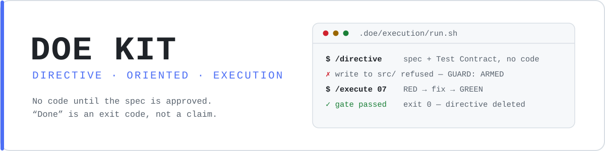
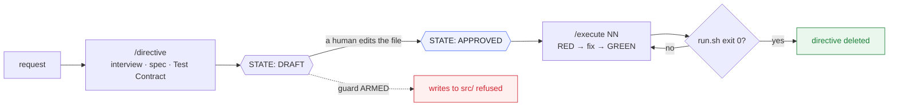

<div align="center">

<picture>
  <source media="(prefers-color-scheme: dark)" srcset="docs/assets/banner-dark.svg">
  <source media="(prefers-color-scheme: light)" srcset="docs/assets/banner-light.svg">
  
</picture>

<p>
  <a href="https://github.com/savinofiore/doe-kit/actions/workflows/kit-selftest.yml"></a>
  <a href="https://github.com/savinofiore/doe-kit/releases"></a>
  <a href="#install"></a>
  
  
  <a href="LICENSE"></a>
  
</p>

<p><b>Directive-first, test-driven development for coding agents.</b><br>
An agent may not touch your code until a spec is written and a human has approved it —<br>
and "done" is an exit code, not a claim.</p>

<a href="#install"><b>Install</b></a> ·
<a href="docs/methodology.md"><b>Methodology</b></a> ·
<a href="docs/workflow.md"><b>Workflow</b></a> ·
<a href="docs/benchmark.md"><b>Benchmark</b></a> ·
<a href="CONTRIBUTING.md"><b>Contributing</b></a>

</div>

---

```
/directive  → interview + spec + Test Contract  (STATE: DRAFT)   [ZERO code]
     ↓  you review and set STATE: APPROVED by hand  ← this unlocks the guard
/execute NN → RED → fix → green gate → the directive is deleted
```

The rule is not written in a prompt and hoped for. A `PreToolUse` hook **mechanically blocks**
every write into your source and test directories until an approved directive exists.



---

## The three problems it fixes

| | Problem | What DOE does |
|:--:|---|---|
| 🎯 | The agent implements something adjacent to what you asked | The spec is written and human-approved *before* any code |
| 🧾 | "Done!" — based on the agent's own summary | Done = `run.sh` exits 0. The test runner is the only judge |
| 🔴 | A red test tempts the agent to edit the test | The red-test rule, enforced by process and by the directive's test-impact table |

The second one is the expensive one. An agent's confidence is uncorrelated with its
correctness, and the only cheap way to tell them apart is a gate it cannot argue with.

---

## Install

**One command**, from inside the project you want to set up:

```bash
curl -fsSL https://raw.githubusercontent.com/savinofiore/doe-kit/main/install.sh | bash -s -- --stack flutter
```

`--stack web-ts` for TypeScript. It clones itself to a temp dir, writes `.doe/`, Claude and
Codex skill directories, merges each agent's hook configuration without touching existing
settings, and cleans up after itself.

**Or as a Claude Code plugin** — skills namespaced, updates with one command, no files copied
into the repo until you ask:

```
/plugin marketplace add savinofiore/doe-kit
/plugin install doe-kit@doe-kit
/doe-kit:init flutter
```

`/doe-kit:init` scaffolds the project side (`.doe/`, templates, gate scripts, config). Update
later with `/plugin marketplace update`.

| | one-liner | plugin |
|---|---|---|
| **Skill names** | `/directive` | `/doe-kit:directive` — namespaced, can never collide |
| **Updates** | re-run the command | `/plugin marketplace update` |
| **Scope** | this project | every project where it is enabled |
| **Guard** | armed by `.doe/` | armed by `.doe/`, **dormant everywhere else** |

That last row is what makes the plugin safe to enable globally: a project with no `.doe/`
directory is not a DOE project, and the guard blocks nothing there.

**Or as a Codex plugin** — the same skills are available through Codex's marketplace:

```bash
codex plugin marketplace add https://github.com/savinofiore/doe-kit.git
codex plugin add doe-kit@doe-kit
```

Then start a new Codex task and ask it to “set up DOE for this project” (or run the installed
`init` skill). Codex plugin manifests currently package skills, while the write guard is a
project hook; `install.sh` wires it into `.codex/hooks.json` along with `.codex/skills/`.

### Verify

```bash
.doe/execution/directive_guard.py --status   # GUARD: ARMED
.doe/execution/guard_selftest.py             # no false positives, no false negatives
.doe/execution/run.sh                        # your gate — must be green before you start
```

Then ask your agent to change something under your source root. The write is refused and the
interview starts. **That refusal is the system working.**

Needs `python3` (standard library only) and `git`. In Claude Code the hook goes live
immediately — the settings watcher picks it up, no restart — and `/hooks` shows it.

---

## The skills

<table>
<tr><td valign="top" width="50%">

**Core** — every stack

| skill | what it does |
|---|---|
| `/directive` | Phase 1 — interview, spec, Test Contract. Zero code |
| `/execute` | Phase 2 — baseline → RED → fix → green gate → cleanup |
| `/doe-review` | Branch/PR review, findings split by testability |
| `/doe-review-fix` | Applies them on two tracks: directives, and direct fixes |
| `/diagnose` | Three competing hypotheses, minimal logging, no fix until proven |
| `/delta-check` | Read-only convention check on the branch delta only |
| `/port-commits` | Enumerate-then-verify porting; silent skips become loud |

</td><td valign="top" width="50%">

**Stacks** — installed per `--stack`

| skill | stack |
|---|---|
| `/riverpod-architect` | flutter — state architecture before any code |
| `/scaffold-feature` | flutter — full feature, tests mirrored |
| `/fix-style` | flutter — design tokens and naming |
| `/test-plan` | flutter — manual checklist from the diff |
| `/test-run` | flutter — drives the checklist through UI automation |
| `/frontend-standards` | web-ts — React/Next composition, state, perf |
| `/backend-standards` | web-ts — layered Express/Prisma/Zod architecture |
| `/ui-standards` · `/i18n-translator` | shared — a11y, and a validator that fails CI |

</td></tr>
</table>

The Flutter stack also ships the feature pipeline — design the state, spec it, scaffold it
tests-first, review it, fix what no test can see:

```
riverpod-architect → /directive → [approve] → /execute (scaffold-feature) → /doe-review → /doe-review-fix (fix-style)
```

Those three read your token names from `.doe/conventions.json` and **refuse to run without
it**: a style skill that guesses your design system produces fixes that compile and are wrong,
which is worse than no fix because it looks done.

---

## What is in the box

<details>
<summary><b>Repository layout</b></summary>

```
skills/              all 17 skills, one copy — both plugins load them all, the installer
                     picks per stack from the skills.txt manifests
hooks/hooks.json     the PreToolUse guard, for the plugin path
.claude-plugin/      plugin.json + marketplace.json
.codex-plugin/       Codex plugin manifest
.agents/plugins/     Codex marketplace manifest

core/
├── templates/       00_FEATURE · 00_BUG · 00_REVIEW directive templates
└── execution/       directive_guard.py · guard_selftest.py     (stack-agnostic)

stacks/
├── web-ts/          run.sh · coverage.sh · coverage-check.mjs + frontend/backend standards
├── flutter/         run.sh · coverage.sh + riverpod-architect · scaffold-feature · fix-style
│                    · test-plan · test-run, driven by .doe/conventions.json
└── shared/          ui-standards · i18n-translator (+ a validator that fails CI)

bench/               the token/quality benchmark harness — tasks, runner, analysis
docs/                methodology · workflow · enforcement · coverage-gate · adoption · benchmark
```

</details>

| doc | what is in it |
|---|---|
| [methodology.md](docs/methodology.md) | the three levels, the three flows, the red-test rule |
| [workflow.md](docs/workflow.md) | a day with DOE: one feature, one bug, one review |
| [enforcement.md](docs/enforcement.md) | the guard, the self-test, CI |
| [coverage-gate.md](docs/coverage-gate.md) | per-file coverage, skip-list, keep-list, the KPI to watch |
| [adoption.md](docs/adoption.md) | installing it in an existing project, and rolling it out |
| [benchmark.md](docs/benchmark.md) | does the process actually pay for its tokens — and how to prove it |

---

## The parts worth stealing even if you skip the rest

> **The test-impact table.** Every directive declares which existing tests it is allowed to
> change, and each row must map to a declared behaviour change. During execution the agent may
> touch *only* those tests. This is what makes "never edit a test to make it pass" mechanical
> instead of aspirational.

> **Findings classified by testability, not just severity.** `/doe-review` splits findings into
> logic-testable (→ a directive with a regression test) and non-testable (→ a direct fix in the
> report). A gate that pretends to verify a colour token is a gate nobody believes.

> **A logged skip-list.** The coverage gate excludes the view layer — and prints every exclusion
> with its reason. An invisible skip-list turns the gate into theatre.

> **A self-test for the guard.** The guard is the only component that, when it breaks, turns
> nothing red: it just stops protecting. Its regression suite tests both directions — writes
> that should be blocked, *and* legitimate work that must never be. A guard that blocks `grep`
> gets disabled within the hour, and a disabled guard protects nothing.

> **Per-file coverage on changed files only.** A repo at 15% global coverage can adopt this
> today. It does not demand a retroactive testing project — it demands that new work arrives
> covered.

---

## Does it pay for its tokens?

DOE spends more tokens than "just write the feature": an interview, a spec, a human gate, a
red run before a green one. The claim that this buys better test-driven code is an empirical
claim, and this repo ships the experiment instead of the anecdote.

**[docs/benchmark.md](docs/benchmark.md)** — the protocol: paired arms on the same tasks,
**hidden** acceptance tests the agent never sees, mutation score as the anti-gaming metric for
test quality, and a token-matched control arm that answers the only question that matters:

> at the *same* token budget, does the process still win — or was it just the tokens?

`bench/` is the runnable harness. Results are reported with confidence intervals, or not
reported at all.

---

## Honest limits

- **The round-trip is real.** Every change goes through a written spec. For a throwaway
  prototype that is a bad trade.
- **The gate only sees what a unit test can reach.** If your business logic lives inside
  components and route handlers, you will need to move it out first — see
  [adoption.md](docs/adoption.md). This is a feature disguised as a prerequisite.
- **The Bash guard is a heuristic, not a shell parser.** It stops the process being bypassed
  by inattention. Anyone determined to bypass it already has `DOE_BYPASS=1`, which at least is
  explicit.

---

## Origin

Distilled from production use across Flutter apps, Next.js sites and Node backends — including
the bugs that shaped each rule. The comments in `directive_guard.py` about heredoc bodies and
about the self-test that skipped itself are not hypotheticals; they are incident reports.

## License

MIT — see [LICENSE](LICENSE).

<div align="center"><sub>Built by <a href="https://github.com/savinofiore">Savino Fiore</a> · issues and PRs welcome</sub></div>
